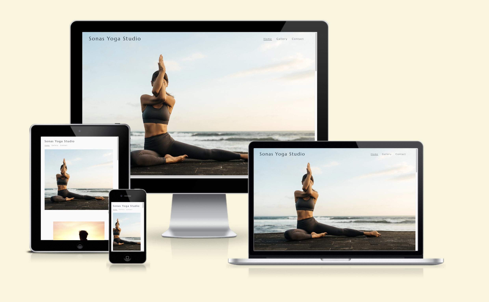
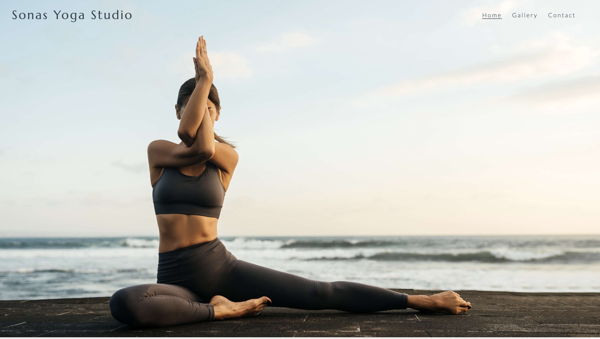
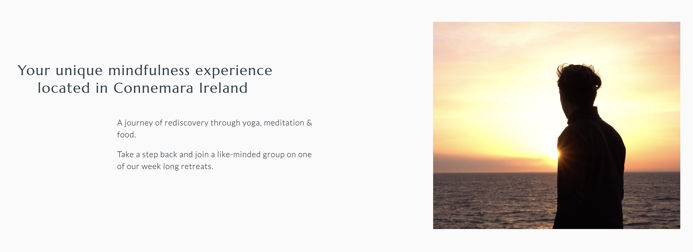
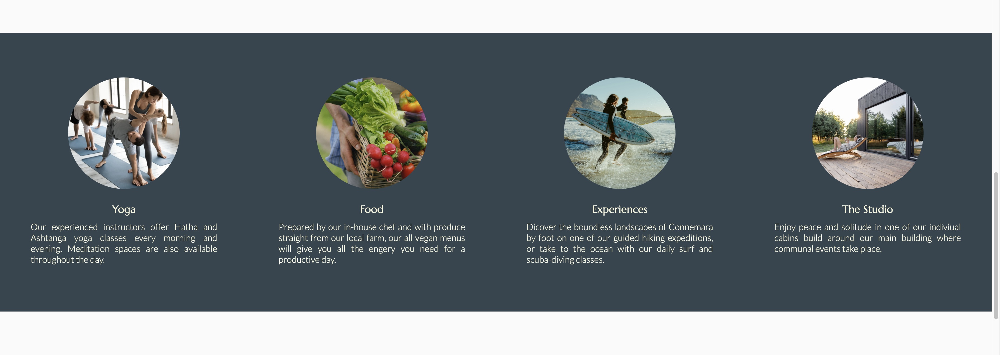
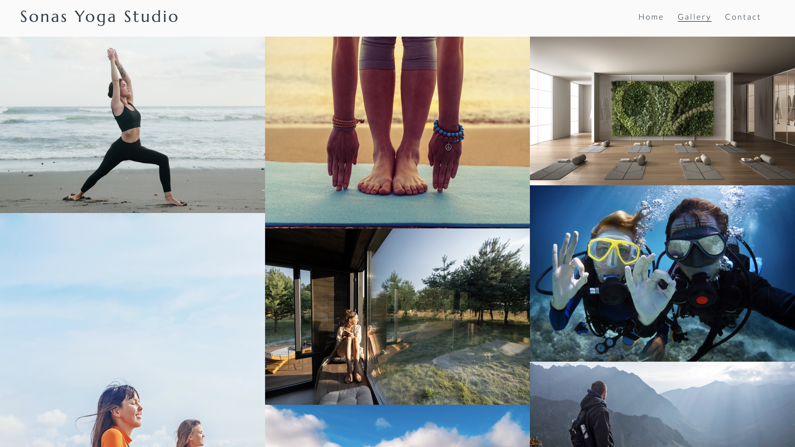
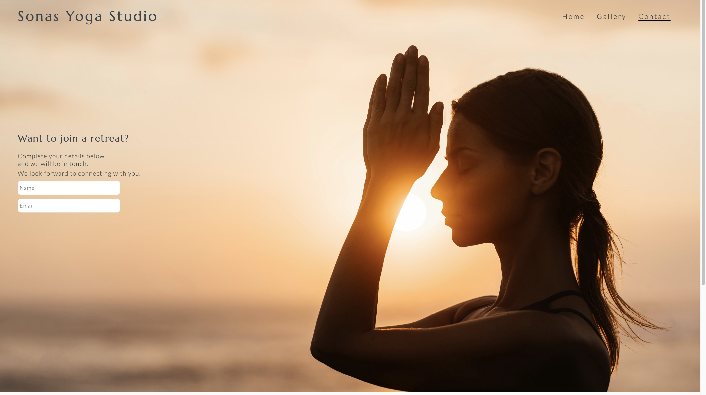
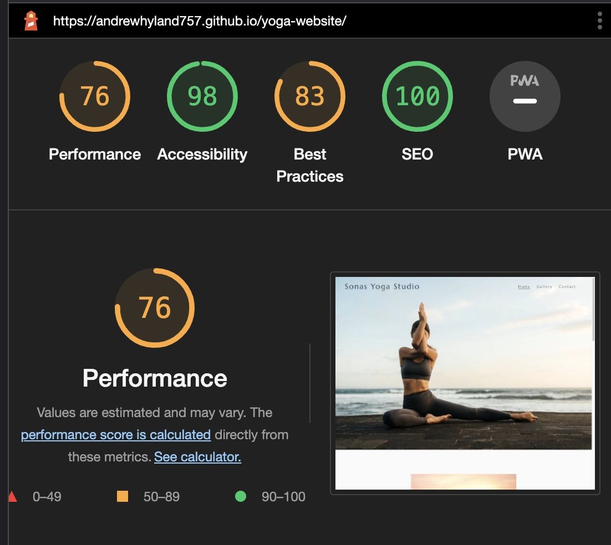

# Sonas Yoga studio

Sonas Yoga Studio is a site for a boutique yoga retreat in Connemara Ireland.  The site aims to convey the sensibility and values of the studio with a tone of sophistication, exclusivity, well-being, and calm. 

## Features

### Navigation Bar

* Situated on the top-right of all three pages this provides the user with a clear and easily identifiable way to go between the pages.
* The logo sits to the right of the page.
* The main image and logo set an appropriate tone and aline with the values of the studio. 

### Ethos Section

* This provides a brief description of the retreat and its location.
* The image conveys a sense of calm and intropection reflecting the journey and self-discovery available on offer. 
* This generates interest and intrigue for the user. 

### Offers Section

* In this section further details are given on the retreat and what it offers with clear images to accompany the descriptions.
* The user can get a real sense of what the studio is about here and the services it provides.   

### Video Section
* Here a short video is played showing the natural beauty of the location the retreat takes place with appropriate music. 

### Footer Section
* In the footer section hyperlinks are provided to the studio's social media accounts.
* These open on a new tab.  

### Gallery Page

* On the gallery page a selection of images shows guests enjoying themselves.
* It elaborates further on the offers section with images. 
* It clearly shows the user what they can expect on the retreat. 

### Contact

* On the contact page two input fields are available for the user to enter their name and email.
* It encourages the user to reach out and then receive further details on upcoming dates and availability with a personal email.  
* The image is of the same model in the home page main image but with a contrasting tone. 
## Testing

* The site has been tested on Google Chrome, Safari and Firefox. 
* It is responsive and works on all standard screen sizes. 

## Validator Testing

* HTML no errors found using the official W3C validator. 
* CSS no errors found using the Jigsaw validator. 

## Accessibility

I have tested the site on Lighthouse and the results show the level of accessibility is good. 

## Unfixed Bugs
None

## Deployment
The site was deployed to GitHub pages. The steps to deploy are as follows:
In the GitHub repository, navigate to the Settings tab
From the source section drop-down menu, select the Master Branch
Once the master branch has been selected, the page will be automatically refreshed with a detailed ribbon display to indicate the successful deployment.
The live link can be found here - https://andrewhyland757.github.io/yoga-website/index.html

## Credits

All images are from Shutterstock.

